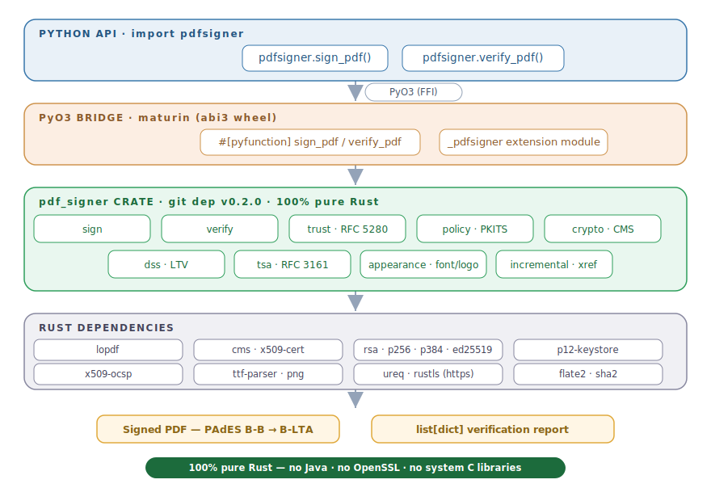

# pdfsigner (Python)

[](https://pypi.org/project/pdfsignerpy/)
[](https://pypi.org/project/pdfsignerpy/)
[](https://pypi.org/project/pdfsignerpy/)
[](https://github.com/StrategicProjects/pdfsignerpy/actions/workflows/ci.yml)
[](https://www.gnu.org/licenses/gpl-3.0)
[](https://github.com/StrategicProjects/pdf_signer)
[](https://doi.org/10.5281/zenodo.21366112)

> Digitally **sign** and **verify** PDF documents — full **PAdES** (ETSI EN 319
> 142) from **B-B to B-LTA** — with a **single, dependency-free wheel**.
> No Java, no OpenSSL, no Poppler, no system libraries.

```bash
pip install pdfsignerpy      # pre-built wheels — no compiler, no Rust needed
```
```python
import pdfsigner
pdfsigner.sign_pdf("in.pdf", "out.pdf", "keystore.p12", "password")
print(pdfsigner.verify_pdf("out.pdf")[0]["valid"])   # True
```

## Why pdfsigner?

Most Python PDF-signing libraries lean on heavy native stacks — OpenSSL via
`cryptography`, a Java runtime, or external tools like Poppler. `pdfsigner`
bundles the **entire crypto + PDF pipeline as one self-contained Rust extension**
(the pure-Rust [`pdf_signer`](https://github.com/StrategicProjects/pdf_signer)
crate, wrapped with [PyO3](https://pyo3.rs/)).

- 🦀 **Zero system dependencies** — no OpenSSL, no Java, no Poppler, no `cffi`.
  One wheel, nothing to apt-get.
- 📦 **Pre-built wheels** for Linux (x86_64 · aarch64), macOS (Intel · Apple
  Silicon, universal2) and Windows — `pip install` and go, no Rust toolchain.
- 🔏 **Real PAdES, B-B → B-LTA** — CAdES `signing-certificate-v2`, RFC 3161
  signature **and** document timestamps, and long-term validation (`/DSS` with
  the chain, CRLs and OCSP).
- ✅ **Verification you can trust** — RFC 5280 path validation whose name
  constraints and certificate-policy engine are **validated against the NIST
  PKITS** suite (42/42 policy + 38/38 name-constraint tests).
- 🔑 **Modern keys** — RSA, ECDSA (P-256/P-384) and Ed25519; CRL + OCSP
  revocation.
- 🖋 **Rich visible signatures** — a bordered box with an **embedded
  TrueType/OpenType font** and a **PNG/JPEG logo**, placed anywhere on any page.
- 🧩 **Incremental updates** — sign repeatedly; earlier signatures stay valid.
- 🔁 **One engine, two languages** — the same backend powers the
  [`pdfsigner` R package](https://github.com/StrategicProjects/pdfsigner).

## Installation

```bash
pip install pdfsignerpy
```

Wheels are published for common platforms, so installation needs **no compiler
and no Rust**. To build from source on an unsupported platform, install a Rust
toolchain from <https://rustup.rs> first (pip will compile it automatically).

> The PyPI distribution is **`pdfsignerpy`**, but you `import pdfsigner`
> (the name `pdfsigner` is blocked on PyPI as too similar to `pdf-signer`).

## Usage

```python
import pdfsigner

# Sign (invisible). Levels above "bb" need a tsa_url.
pdfsigner.sign_pdf(
    "input.pdf", "signed.pdf", "keystore.p12", "password",
    reason="Approval",
    level="bb",                     # bb | bt | blt | blta
)

# Sign with a visible box, an embedded font and a logo.
pdfsigner.sign_pdf(
    "input.pdf", "signed.pdf", "keystore.p12", "password",
    signtext="Digitally signed",
    font="Arial.ttf",
    image="logo.png",
    level="blta",
    tsa_url="http://timestamp.digicert.com",
)

# Verify every signature.
for s in pdfsigner.verify_pdf("signed.pdf"):
    print(s["valid"], s["signer"], s["detail"])

# Verify and validate the signer chain against trusted roots (e.g. ICP-Brasil).
pdfsigner.verify_pdf("signed.pdf", roots="icp-brasil-roots.pem")
```

`verify_pdf` returns one dict per signature with keys: `valid`, `signer`,
`chain_trusted` (bool or `None` when no `roots` given), `covers_whole_document`,
`signed_len`, `byte_range` and `detail`.

## Architecture



`import pdfsigner` calls a thin [PyO3](https://pyo3.rs/) extension module that
links the pure-Rust **`pdf_signer`** crate (a git dependency pinned to `v0.1.7`).
The same engine powers the
[`pdfsigner` R package](https://github.com/StrategicProjects/pdfsigner).

## Authors

- **André Leite** — Universidade Federal de Pernambuco (maintainer)
- **Hugo Vasconcelos** — Universidade Federal de Pernambuco
- **Diogo Bezerra** — Universidade Federal de Pernambuco
- **Marcos Wasiliew** — Universidade Federal de Pernambuco
- **Carlos Amorim** — Universidade Federal de Pernambuco

## Citation

If you use this software, please cite it using the metadata in
[`CITATION.cff`](CITATION.cff).

## License

GPL-3.0-or-later. The bundled `pdf_signer` crate and its Rust dependencies
retain their own (permissive) licenses.
